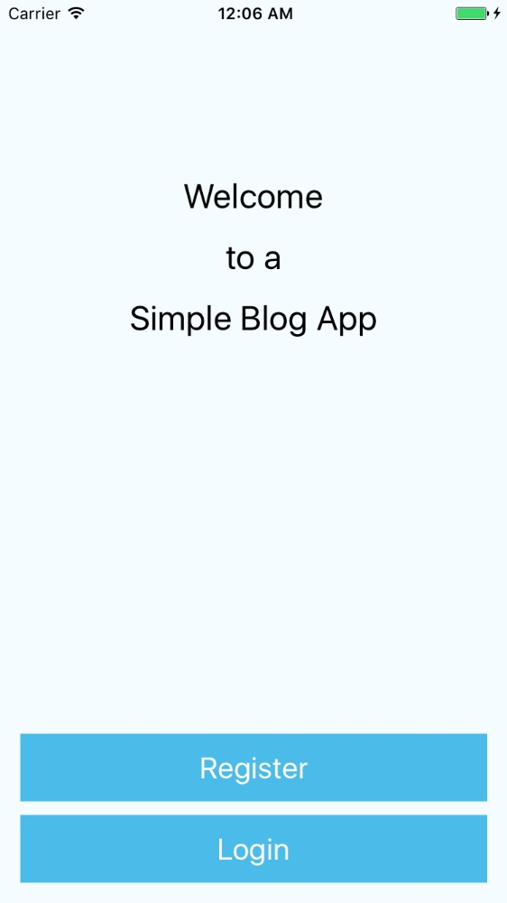

# Blog App

A simple [blog app](https://appetize.io/app/jnhahxte9j2wwygntg5jummhjr?device=iphone5s&scale=75&orientation=portrait&osVersion=9.3) built with [React-Native](https://facebook.github.io/react-native/).

## Motivation

This was a flex-week project in the full-time [Thinkful Web Development Bootcamp](https://www.thinkful.com/bootcamp/web-development/full-time/).

The goal was to learn a new framework and create a project with it within one week. This was achieved here by creating a mobile application using [React-Native](https://facebook.github.io/react-native/).

The app has limited functionality at present, including:
  - Create, Read and Delete blog posts
  - Authentication persistance via [json web tokens](https://jwt.io/)

## Technologies

| **Tech** | **Description** |
|----------|-------|
|  [CSS](https://developer.mozilla.org/en-US/docs/Web/CSS)  |   UI Styling    |
|  [React Native](https://facebook.github.io/react-native/)  |   Enables React to run natively on mobile devices using native UI components    |
|  [Express](http://expressjs.com/)  |   Server framework for Node   |
|  [MongoDB](https://www.mongodb.com/)  |   No-SQL database    |

## Develop

To develop this app:
- clone the repo
- run `npm install`
- open [Xcode](https://developer.apple.com/xcode/) if on OSX and developing for iOS
  - other development environments are available for [other platforms](https://facebook.github.io/react-native/docs/getting-started.html#content)
- a prototype can be deployed through [appetize.io](https://appetize.io/). A helpful tutorial to build the app for appetize deployment is available [here](https://medium.com/@callMeNorm/prototyping-react-native-with-appetize-io-752f6d303668#.y3kdtesme).

To develop this app's server side:
- comment out the `fetch('https://portfolio-express.herokuapp.com/blog/'` calls in
  - `Register.js`
  - `Posts.js`
  - `Login.js`
  - `BlogPostForm.js`
  and replace with the commented out line above these calls. The url will include `fetch('http://localhost:8080/blog/'`
- the server side is currently a submodule of a larger portfolio server
- to develop it locally:
  - clone, configure and start the [app's express server](https://github.com/jpke/PortfolioExpress)
  - comment out or delete `app.use('/med', medReminder)` and `app.use('/elearn', eLearn)` in `server.js`
  - comment out or delete files:
    - `medReminder.js`
    - `emailer.js`
    - `box.js`
    - `eLearn.js`
  - add `.env` file, containing:
    - `SECRET` :: a string that will serve as your json web token private key
    - `DATABASE_URI` :: connection to your mongo database `'mongodb://<database name>'`
  - start server with `node server.js`
  - server will now run at `http://localhost:8080` by default

##
##### Contributers
* jpke
